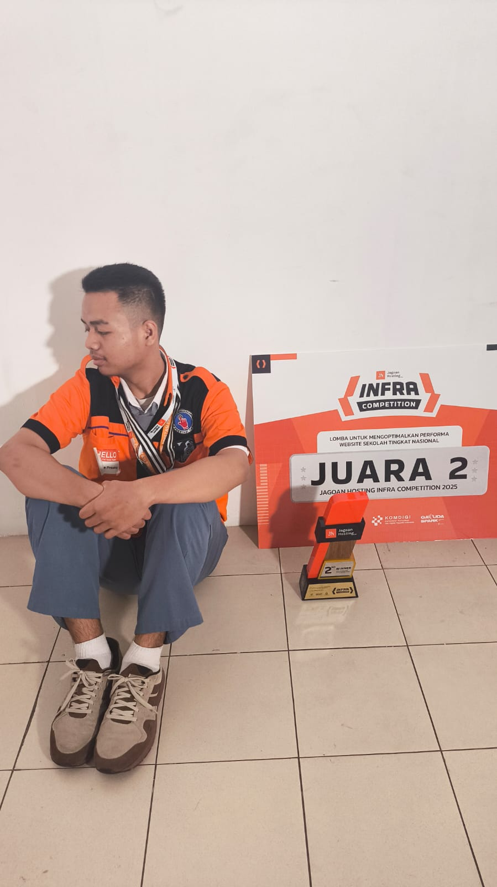

<h1 align="center">Halo, Saya Rafael Abimanyu 👋</h1>

  

  
  

---

<h2 align="center">🏅 National Achievement</h2>

  
   
  <i>Berhasil meraih Juara 2 Nasional dalam kompetisi mengoptimasi website yang diselenggarakan oleh <b>Jagoan Hosting</b> di Surabaya.</i>

---
---

<h1 align="center">
  🚀 About Me
</h1>

  

  

<table align="center">
<tr>
<td width="60%" valign="top">

## 👋 Hello World

Saya adalah seorang **Web Developer & Tech Enthusiast** yang berfokus pada pembangunan aplikasi modern dengan performa tinggi, desain elegan, dan arsitektur yang scalable.

Saya senang membangun sistem digital yang tidak hanya terlihat menarik, tetapi juga memiliki struktur kode yang bersih, aman, dan mudah dikembangkan.

 

## ⚡ Current Focus

- 🚀 High-Performance Web Applications
- 🏢 Digital Business Ecosystem
- 🤖 Artificial Intelligence & Machine Learning
- 🔐 Authentication & RBAC System
- 🎨 Modern UI/UX Experience
- ☁ Deployment & Optimization

 

## 🧠 Developer Philosophy

> *"Technology evolves every day — and so do I.  
> Keep learning, keep building, and keep creating impact."* ✨

 

## 📊 Developer Highlights

  ✨ Clean & Maintainable Code  
  ⚡ Performance Optimization  
  🧩 Modular Architecture  
  📱 Responsive Design  
  🔒 Secure Authentication  
  ☁ Modern Deployment Workflow

</td>

<td width="40%" align="center">

  

 

</td>
</tr>
</table>

 

  

  

---

---

<table align="center">
<tr>

<td valign="top" width="50%">

<h3 align="center">💻 Languages</h3>

  

<h3 align="center">⚡ Frameworks</h3>

  

<h3 align="center">🎨 UI & Styling</h3>

  

<h3 align="center">🧩 Libraries & Packages</h3>

  

<h3 align="center">🗄 Databases</h3>

  

</td>

<td valign="top" width="50%">

<h3 align="center">🛠 Tools</h3>

  

<h3 align="center">☁ Deployment</h3>

  

<h3 align="center">🔧 DevOps</h3>

  

<h3 align="center">📱 Mobile</h3>

  

<h3 align="center">🤖 AI / ML</h3>

  

</td>

</tr>
</table>

---

<h2>🌟 Proyek Pilihan</h2>

<h3>💼 Business & Enterprise</h3>
<table width="100%">
  <tr>
    <td width="50%">
      <b>Rooterin</b> 
      <i>Official Business Website for Rooterin services.</i> 
      <code>Business</code> <code>UI/UX</code>
    </td>
    <td width="50%">
      <b>Rooterin Invoice</b> 
      <i>Internal Operating System & Billing Management.</i> 
      <code>OS</code> <code>Accounting</code> <code>Invoicing</code>
    </td>
  </tr>
  <tr>
    <td width="50%">
      <b>Propertiku</b> 
      <i>Real estate management and listing platform.</i> 
      <code>Property</code> <code>Listing</code>
    </td>
    <td width="50%">
      <b>E-Aspirasi</b> 
      <i>Public Aspiration Portal with RBAC.</i> 
      <code>Gov-Tech</code> <code>Laravel</code>
    </td>
  </tr>
  <tr>
    <td width="50%">
      <b>EventHub</b> 
      <i>Event management and ticketing platform.</i> 
      <code>Event</code> <code>Management</code> <code>Platform</code>
    </td>
    <td width="50%">
      <!-- Slot kosong untuk proyek berikutnya agar layout tetap simetris -->
    </td>
  </tr>
</table>

<h3>🏫 Educational Institutions</h3>
<table width="100%">
  <tr>
    <td width="25%"><b>Politeknik Prestasi Prima</b></td>
    <td width="25%"><b>SMA Prestasi Prima</b></td>
    <td width="25%"><b>SMK Prestasi Prima</b></td>
    <td width="25%"><b>SMPN 283 Jakarta</b></td>
  </tr>
</table>

---

<h2>📊 Statistik GitHub</h2>

  
  

  

